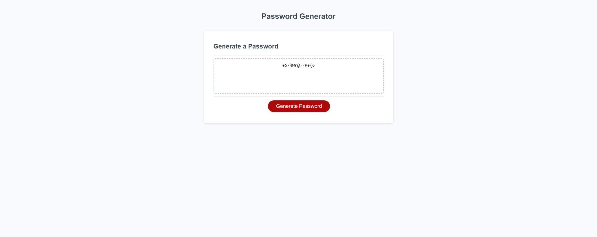

# 05-password-generator

## Description

This repo contains all files related to the week 5 challenge. I was motivated to build a password generator because I wanted to apply JavaScript to a real world problem. The password generator allows users to create a password based on user defined criteria, whilst being between 10 and 64 characters long. This project enabled me to learn more about returning values from functions and accessing those values in other functions by storing them as local variables. It forced me to take into account variable scope and break the challenge down into smaller steps. It also enabled me to practice implementing user validation by using if logic and the return statement to terminate a function when criteria had not been met. In addition, it enabled me to further practice using for loops and calling functions from other functions.

## Installation

N/A

## Usage

This webpage has been set up to enable users to generate a password, in line with the week 5 assignment guidance. This would be useful for anyone that wanted to create a unique and randomised password.

Please see below for a screenshot of the website.

Please refer to the link below to access the webpage:

[Password Generator website](https://nwinch1512.github.io/Console-Finances/ "Visit Console Finances website")

## Credits

N/A

## License

Please refer to the LICENSE in the repo.
